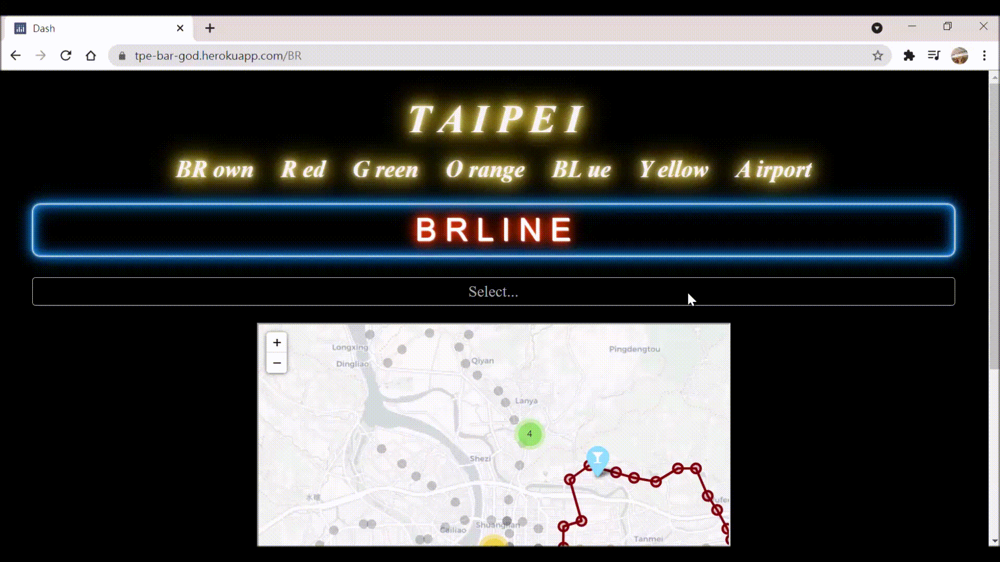

# Taipei Bar Map Web App

* Used python, CSS, Folium, Dash, and Flask to build a multi-page app for Taipei bar searching by MRT station and deployed web app on Heroku.

## Built With
* Python
  - csv
  - numpy
  - pandas
* CSS
* Folium
* Dash
* Flask
* Heroku

## Get Started

* Check locations of MRT stations and bars by Folium map.

* Click on different MRT line to show its map and narrow down MRT staion by dropdown options.

* Choose the MRT station to see bar options and explore more bars on Google and Instagram.

* Choose a bar to see its location, business time, officil Instagram page, and Instagram posts with its location tagging.

